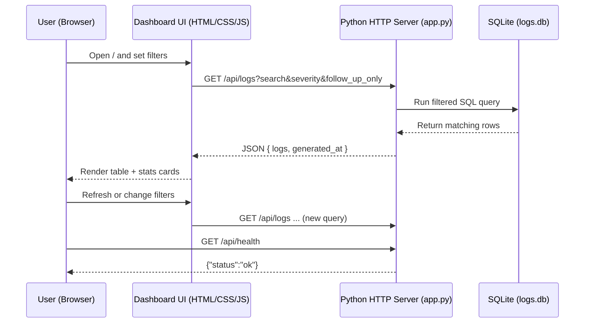

# Customer Log Monitor

A lightweight web dashboard for viewing customer logs stored in SQLite and quickly identifying follow-up opportunities.

## Why you may not have seen a preview

The app is not auto-started in this environment. You need to run the server first, then open the forwarded port URL.

## Run locally

```bash
python3 app.py
```

Then open:
- `http://localhost:8000`

You can also choose a custom port:

```bash
PORT=8080 python3 app.py
```

Then open:
- `http://localhost:8080`

## Quick checks

```bash
curl -s http://localhost:8000/api/health
curl -s "http://localhost:8000/api/logs?follow_up_only=true&severity=high"
```

## Workflow diagram (customer call follow-up)

```mermaid
flowchart TD
    A[Customer call comes in] --> B[Agent logs issue in DB]\
    B --> C[Record stored in customer_logs\nname, email, event, severity, follow_up_required]
    C --> D[Operations opens Customer Log Monitor]
    D --> E[Use search + severity + follow-up filters]
    E --> F[Prioritize high/critical and follow-up-required items]
    F --> G[Assign owner and contact customer]
    G --> H[Follow-up completed]
```

## How this app works (system diagram)



## Features

- Search by customer, email, or message
- Filter by severity and follow-up-required logs
- Summary metric cards for operational visibility
- Seed data so the UI is useful immediately

## API

`GET /api/logs`

Query params:

- `search` (string)
- `severity` (`all|low|medium|high|critical`)
- `follow_up_only` (`true|false`)
